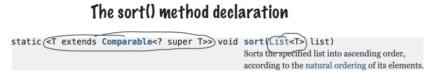
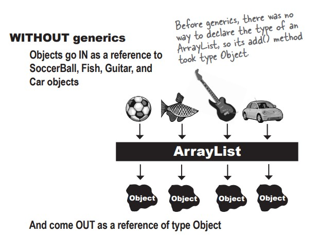
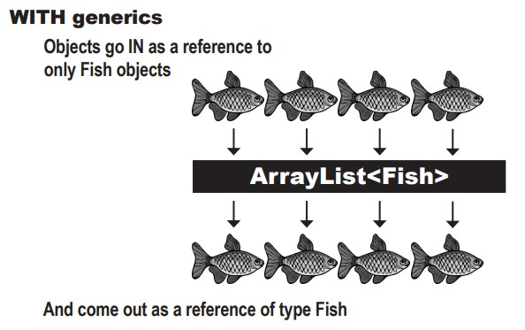

# java-journey

A code journal documenting my Java programming journey through practical examples and projects.

## Table of Contents

- [Introduction](#introduction)
- [Exploring the java.util API : List and Collections](#Exploring-the-javautil-APIList-and-Collections)
- [Generics](#generics)
  - [Using generics CLASSES](#using-generics-classes)
  - [Using type parameters with ArrayList CLASSES](#using-type-parameters-with-arraylist-classes)
  - [Using generics METHODS](#using-generics-methods)
  - [Using a custom Comparator](#using-a-custom-comparator)
- [The Collection API](#the-collection-api)
  - [Using a HashSet instead of ArrayList](#using-a-hashset-instead-of-arraylist)
  - [What makes two objects equal](#what-makes-two-objects-equal)
  - [What you MUST know about TreeSet](#what-you-must-know-about-treeset)
- [Questions](#questions)

## Introduction

The diamond Operator : is a syntax give us the possibily for not specifying type twice in arrayList declaration. for example

```
ArrayList<String> songs = new ArrayList<String>();
```

we don't need to specify _type String_ two time, we can just write :

```
ArrayList<String> songs = new ArrayList<>();
```

thanks to type reference used by the compiler

## Exploring the java.util API : List and Collections

We know that with an ArrayList, or any List, the elements are kept in the order in which they were added.

```
    List<String> songs = new ArrayList<>();
        songs.add("somersault");
        songs.add("cassidy");
        songs.add("$10");
        songs.add("havana");
        songs.add("Cassidy");
        songs.add("50 Ways");
```

when we print we get :

```
    [somersault, cassidy, $10, havana, Cassidy, 50 Ways]
```

### _Natural Ordering_ what Java means by alphabetical

let's try sorting our songs alphabetically :

```
    public void go() {
        List<String> songList = MockSongs.getSongStrings();
        System.out.println(songList);
        Collections.sort(songList);
        System.out.println(songList);
    }
```

console :

```
[somersault, cassidy, $10, havana, Cassidy, 50 Ways]
[$10, 50 Ways, Cassidy, cassidy, havana, somersault]

```

What if we try to sort with Object ?
for example in arrayList we will add object of Songs :

```
    public void go() {
        List<SongV2> songList = MockSongs.getSongStrings();
        System.out.println(songList);
        Collections.sort(songList);
        System.out.println(songList);
    }
```

waht's happen ?!!!! **The compiler says it can’t find a sort method that takes a List<SongV2>**



## Generics

1- Generics means more type-safety

Although generics can be used in other ways, you’ll often use generics to write type-safe collections. In other words, code that makes the compiler stop you from putting a Dog into a list of Ducks.

With generics, you can create type-safe collections where more problems are caught at
compile-time instead of runtime.




2- Learning Generics

- Creating instances of generic classes (like ArrayList)

  When you make an ArrayList, you have to tell it the type of
  objects you’ll allow in the list.

```
new ArrayList<Song>();
```

- Declaring and assigning variables of generic types

```
List<Song> songList = new ArrayList<Song>()
```

- Declaring (and invoking) methods that take generic types

````
void foo(List<Song> list)
x.foo(songList)
```
### Using generics CLASSES

```
public class ArrayList<E1> extends AbstractList<E2> implements List<E3> ...{

  public boolean add(E4 o)
  //More code
}
```

E1 : The "E" is placeholder for the REAL type you use when you declare and create an ArrayList.

E2 : ArrayList is a subclass of AbstractList, so whatever type you specify for the ArrayList is automatically used for the type of the AbstractList

E3 : The type (the valye of<E>)becomes the type of the List, interface as well.

E4 : Here is the important part! whatever "E" is determines what kind of things you are allowed to add to the ArrayList.


The "E" represents the type used to create an instance of ArrayList. So new ArrayList<Song> means that "E" becomes "Song" in any method nd variable declaration that uses "E".

### Using type parameters with ArrayList CLASSES

this code
```
List<String> thisList = new ArrayList<>
```
Means ArrayList:
```
public class ArrayList<E> extends AbstractList<E> ....{
  public boolean add(E o)
  //more code
}
```

And E is String. that means is treated by the compiler as:
```
public class ArrayList<String> extends AbstractList<String> ....{
  public boolean add(String o)
  //more code
}
```
In other words, the "E" is replaced by the real type (also called the _type parameter_ ) that you use when you create the ArrayList.

### Using generics METHODS

A generic class means that the _the class declaration_ includes a type parameter. A generic method means that the _method declaration_ use a type parameter in its signature.

1- Using a type parameter defined in the class declaration

```
public class ArrayList<E> extends AbstractList<E> ...{
  public boolean add(E o)
}
```
E: You can use the "E" here ONLY because it's already been defined as part of the class.

The type declared in the method argument is essentially replaced with the type you use when you instantiate the class.

2- Using a type parameter that was NOT defined in the class declaration

```
public  <T1 extends Animal> void takeThing(ArrayList<T2> list)
```
T2: here we can use <T> because we declared "T" at the start (T1) of method declaration ()


In generics, the keyword "extends" really means "IS-A" and work for both classes and interfaces.


- Invoking the Collections.sort(List list) method means the list element’s compareTo() method determines the order. The elements in the list MUST implement the Comparable interface.
- Invoking List.sort(Comparator c) or Collections.sort(List list, Comparator c) means the Comparator’s compare() method will be used. That means the elements in the list do NOT
need to implement the Comparable interface, but if they do, the list element’s compareTo()
method will NOT be called.

Now we’re able to sort the song list two ways:

1. Using Collections.sort(songList), because Song implements Comparable
2. Using songLists.sort(artistCompare) because the ArtistCompare class implements Comparator.

### Using a custom Comparator

To DO

## The Collection API

To DO

### Using a HashSet instead of ArrayList

To DO

### What makes two objects equal

To DO

### What you MUST know about TreeSet

To DO

# Questions :

- Q1 : Because an ArrayList IS-A List, we can create an arrayList store it in a List. and return List from the method.
  But, why we do that ?
  `List<String> songs = new ArrayList<>();`

R1 : One of the advantages of polymorphism is that code doesn’t need to know the specific implementation type of an object to work well with it. List is a well-known, wellunderstood interface . Code that is working with an ArrayList doesn’t usually need to know it’s an ArrayList. It could be a LinkedList. Or a specialized type of List. Code that’s working with the List only needs to know it can call List methods on it (like ad(),size() etc). It’s usually safer to pass the interface type (i.e., List) around instead of the implementation. That way, other code can’t go rooting around inside your object in a way that was never intended.It also means that should you ever want to change from an ArrayList to a LinkedList, or a CopyOnWriteArrayList (see Chapter 18, Dealing with Concurrency Issues) at a later date, you can without having to change all the places the List is used.
````
