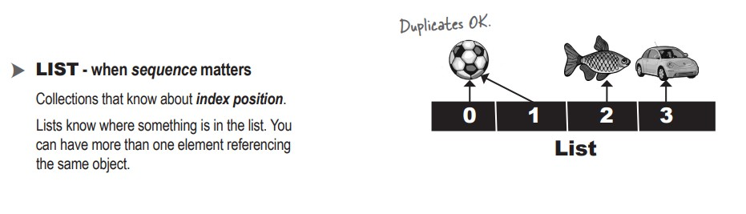
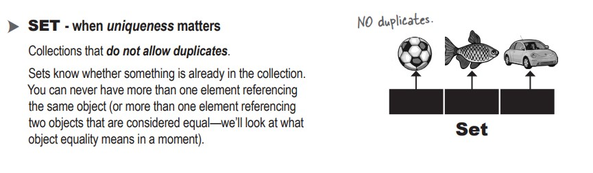
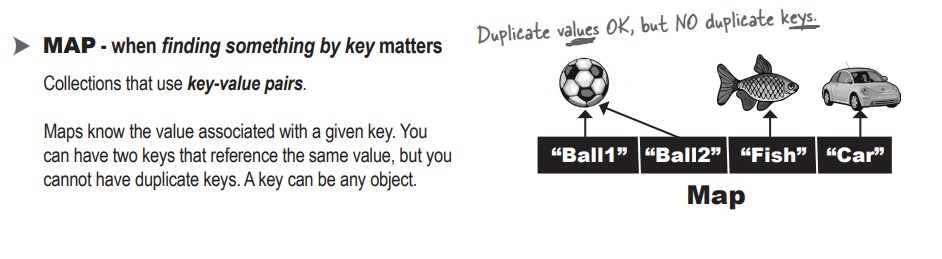
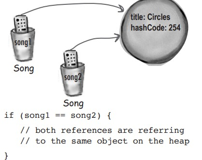
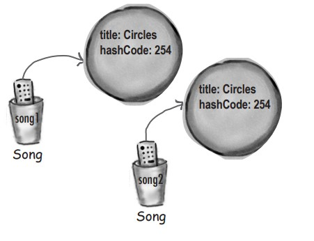
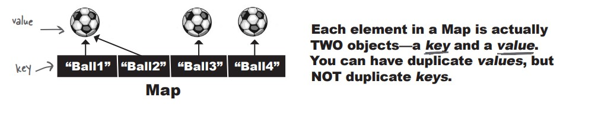

# java-journey

A code journal documenting my Java programming journey through practical examples and projects.

## Table of Contents

- [Introduction](#introduction)
- [Exploring the java.util API : List and Collections](#Exploring-the-javautil-APIList-and-Collections)
- [Generics](#generics)
  - [Using generics CLASSES](#using-generics-classes)
  - [Using type parameters with ArrayList CLASSES](#using-type-parameters-with-arraylist-classes)
  - [Using generics METHODS](#using-generics-methods)
  - [Using a custom Comparator](#using-a-custom-comparator)
- [The Collection API](#the-collection-api)
  - [Using a HashSet instead of ArrayList](#using-a-hashset-instead-of-arraylist)
  - [What makes two objects equal](#what-makes-two-objects-equal)
  - [What you MUST know about TreeSet](#what-you-must-know-about-treeset)
- [Questions](#questions)

## Introduction

The diamond Operator : is a syntax give us the possibily for not specifying type twice in arrayList declaration. for example

```
ArrayList<String> songs = new ArrayList<String>();
```

we don't need to specify _type String_ two time, we can just write :

```
ArrayList<String> songs = new ArrayList<>();
```

thanks to type reference used by the compiler

## Exploring the java.util API : List and Collections

We know that with an ArrayList, or any List, the elements are kept in the order in which they were added.

```
    List<String> songs = new ArrayList<>();
        songs.add("somersault");
        songs.add("cassidy");
        songs.add("$10");
        songs.add("havana");
        songs.add("Cassidy");
        songs.add("50 Ways");
```

when we print we get :

```
    [somersault, cassidy, $10, havana, Cassidy, 50 Ways]
```

### _Natural Ordering_ what Java means by alphabetical

let's try sorting our songs alphabetically :

```
    public void go() {
        List<String> songList = MockSongs.getSongStrings();
        System.out.println(songList);
        Collections.sort(songList);
        System.out.println(songList);
    }
```

console :

```
[somersault, cassidy, $10, havana, Cassidy, 50 Ways]
[$10, 50 Ways, Cassidy, cassidy, havana, somersault]

```

What if we try to sort with Object ?
for example in arrayList we will add object of Songs :

```
    public void go() {
        List<SongV2> songList = MockSongs.getSongStrings();
        System.out.println(songList);
        Collections.sort(songList);
        System.out.println(songList);
    }
```

waht's happen ?!!!! **The compiler says it can’t find a sort method that takes a List<SongV2>**


## Generics

1- Generics means more type-safety

Although generics can be used in other ways, you’ll often use generics to write type-safe collections. In other words, code that makes the compiler stop you from putting a Dog into a list of Ducks.

With generics, you can create type-safe collections where more problems are caught at
compile-time instead of runtime.


2- Learning Generics

- Creating instances of generic classes (like ArrayList)

  When you make an ArrayList, you have to tell it the type of
  objects you’ll allow in the list.

```
new ArrayList<Song>();
```

- Declaring and assigning variables of generic types

```
List<Song> songList = new ArrayList<Song>()
```

- Declaring (and invoking) methods that take generic types

```
void foo(List<Song> list)
x.foo(songList)
```

### Using generics CLASSES

```
public class ArrayList<E1> extends AbstractList<E2> implements List<E3> ...{

  public boolean add(E4 o)
  //More code
}
```

E1 : The "E" is placeholder for the REAL type you use when you declare and create an ArrayList.

E2 : ArrayList is a subclass of AbstractList, so whatever type you specify for the ArrayList is automatically used for the type of the AbstractList

E3 : The type (the valye of<E>)becomes the type of the List, interface as well.

E4 : Here is the important part! whatever "E" is determines what kind of things you are allowed to add to the ArrayList.

The "E" represents the type used to create an instance of ArrayList. So new ArrayList<Song> means that "E" becomes "Song" in any method nd variable declaration that uses "E".

### Using type parameters with ArrayList CLASSES

this code

```
List<String> thisList = new ArrayList<>
```

Means ArrayList:

```
public class ArrayList<E> extends AbstractList<E> ....{
  public boolean add(E o)
  //more code
}
```

And E is String. that means is treated by the compiler as:

```
public class ArrayList<String> extends AbstractList<String> ....{
  public boolean add(String o)
  //more code
}
```

In other words, the "E" is replaced by the real type (also called the _type parameter_ ) that you use when you create the ArrayList.

### Using generics METHODS

A generic class means that the _the class declaration_ includes a type parameter. A generic method means that the _method declaration_ use a type parameter in its signature.

1- Using a type parameter defined in the class declaration

```
public class ArrayList<E> extends AbstractList<E> ...{
  public boolean add(E o)
}
```

E: You can use the "E" here ONLY because it's already been defined as part of the class.

The type declared in the method argument is essentially replaced with the type you use when you instantiate the class.

2- Using a type parameter that was NOT defined in the class declaration

```
public  <T1 extends Animal> void takeThing(ArrayList<T2> list)
```

T2: here we can use <T> because we declared "T" at the start (T1) of method declaration ()

In generics, the keyword "extends" really means "IS-A" and work for both classes and interfaces.

- Invoking the Collections.sort(List list) method means the list element’s compareTo() method determines the order. The elements in the list MUST implement the Comparable interface.
- Invoking List.sort(Comparator c) or Collections.sort(List list, Comparator c) means the Comparator’s compare() method will be used. That means the elements in the list do NOT
  need to implement the Comparable interface, but if they do, the list element’s compareTo()
  method will NOT be called.

Now we’re able to sort the song list two ways:

1. Using Collections.sort(songList), because Song implements Comparable
2. Using songLists.sort(artistCompare) because the ArtistCompare class implements Comparator.

### Using a custom Comparator

Sorting using only Comparators :

```
public class Jukebox5 {
 public static void main(String[] args) {
  new Jukebox5().go();
 }
 public void go() {
  List<SongV3> songList = MockSongs.getSongsV3();
  System.out.println(songList);
  TitleCompare titleCompare = new TitleCompare();
  songList.sort(titleCompare);
  System.out.println(songList);
  ArtistCompare artistCompare = new ArtistCompare();
  songList.sort(artistCompare);
  System.out.println(songList);
 }
}
class TitleCompare implements Comparator<SongV3> {
  public int compare(SongV3 one, SongV3 two) {
    return one.getTitle().compareTo(two.getTitle());
  }
}
class ArtistCompare implements Comparator<SongV3> {
  public int compare(SongV3 one, SongV3 two) {
    return one.getArtist().compareTo(two.getArtist());
  }
}
```

Using the innerclass :

```
songList.sort(new Comparator<SongV3>() {
  public int compare(SongV3 one, SongV3 two) {
    return one.getTitle().compareTo(two.getTitle());
  }
});
```

we can sort a list with lambda expression:

```
  public void go() {
    List<SongV2> songList = MockSongs.getSongStrings();
    System.out.println(songList);
    songList.sort((one, two) -> one.getTitle().compareTo(two.getTitle()));
    System.out.println(songList);

    songList.sort((one, two) -> one.getArtist().compareTo(two.getArtist()));
    System.out.println(songList);
  }
```

## The Collection API

we can defferentiate :



AND :


AND :


### Using a HashSet instead of ArrayList

To DO

### What makes two objects equal

- Reference equality : Two references, one object on the heap.



Two references that refer to the same object on the heap are equal. Period. If you call the hashCode() method on both references, you’ll get the same result. If you don’t override the hashCode() method, the default behavior (remember, you inherited this from class Object) is that each object will get a unique number (most versions of Java assign a hashcode based on the object’s memory address on the heap, so no two objects will have the same hashcode). If you want to know if two references are really referring to the same object, use the == operator, which (remember) compares the bits in the variables. If both references point to the same object, the bits will be identical.

- Object equality : Two references, two objects on the heap, but the objects are considered meaningfully equivalent.



If you want to treat two different Song objects as equal (for example if you decided that two Songs are the same if they have matching title variables), you must override both the hashCode() and equals() methods inherited from class Object. As we said above, if you don’t override hashCode(), the default behavior (from Object) is to give each object a unique hashcode value. So you must override hashCode() to be sure that two equivalent objects return the same hashcode. But you must also override equals() so that if you call it on either object, passing in the other object, always returns true.

**The Song class with overridden hashCode() and equals()**

```
class SongV2 implements Comparable<SongV2> {
    private String title;
    private String artist;
    private int bpm;

    public boolean equals(SongV2 aSong) {
        SongV2 other = (SongV2) aSong;
        return title.equals(other.getTitle());
    }

    public int hashCode() {
        return title.hashCode();
    }
    //More Code
}
```

The API docs for class Object state the rules you MUST follow:

- If two objects are equal, they MUST have matching hash codes.
- If two objects are equal, calling equals() on either object MUST return true. In other words, if (a.equals(b)) then (b.equals(a)).
- If two objects have the same hash codevalue, they are NOT required to be equal. But if they’re equal, they MUST have the same hash code value.
- So, if you override equals(), you MUST override hashCode().
- The default behavior of hashCode() is to generate a unique integer for each object on the heap. So if you don’t override hashCode() in a class, no two objects of that type can EVER be considered equal.
- The default behavior of equals() is to do an == comparison. In other words, to test whether the two references refer to a single object on the heap. So if you don’t override equals() in a class, no two objects can EVER be considered equal since references to two different objects will always contain a different bit pattern.
  a.equals(b) must also mean that a.hashCode() == b.hashCode()
  But a.hashCode() == b.hashCode() does NOT have to mean a.equals(b)

### What you MUST know about TreeSet

```
public void go() {
        List<SongV2> songList = MockSongs.getSongStrings();
        System.out.println(songList);

        songList.sort((one, two) -> one.getTitle().compareTo(two.getTitle()));
        System.out.println(songList);

        Set<SongV2> songSetTree = new TreeSet<>(songList);
        System.out.println(songSetTree);
    }
```

If we want the TreeSet to sort on something different:

```
  TreeSet<SongV4> songSet = new TreeSet<>((o1, o2) -> o1.getBpm() - o2.getBpm());
  songSet.addAll(songList);
```

To use a TreeSet, one of these things must be true:

- The elements in the list must be of a type that implements Comparable.

```
class Book implements Comparable<Book> {
 private String title;
 public Book(String t) {
 title = t;
 }
 public int compareTo(Book other) {
 return title.compareTo(other.title);
 }
}
```

OR

- You use the TreeSet’s overloaded constructor that takes a Comparator

TreeSet works a lot like the sort() method—you have a choice of using the element’s compareTo() method, assuming the element type implemented the Comparable interface, OR you can use a custom Comparator that knows how to sort the elements in the set. To use a custom Comparator, you call the TreeSet constructor that takes a Comparator.

```
class BookCompare implements Comparator<Book> {
 public int compare(Book one, Book two) {
 return one.title.compareTo(two.title);
 }
}
```

### We’ve seen Lists and Sets, now we’ll use a Map



### Factory methods for collections

```
ist<String> songs = new ArrayList<>();
 songs.add("somersault");
 songs.add("cassidy");
 songs.add("$10");
 return Collections.unmodifiableList(songs);
```

Return an "Unmodifiable" version of the list we just created so we know no one else can change it. We’ll see in Chapters 12 and 18 why we might want to create data structures that can’t be changed.

Convenience Factory Methods for Collections allow you to easily create a List, Set, or Map that’s been prefilled with known data. There are a couple of things to understand about using them:

- **The resulting collections cannot be changed**. You can’t add to them or alter the values; in fact, you can’t even do the sorting that we’ve seen in this chapter.

- **The resulting collections are not the standard Collections we’ve seen**. These are not ArrayList, HashSet, HashMap, etc. You can rely on them to behave according to their interface: a List will always preserve the order in which the elements were placed; a Set will never have duplicates. But you can’t rely on them being a specific implementation of List, Set, or Map.

- Creating a List: List.of().

```
List<SongV4> songs = List.of(new SongV4("somersault", "zero 7", 147),
                            new SongV4("cassidy", "grateful dead", 158),
                            new SongV4("$10", "hitchhiker", 140)
                          );
```

- Creating a Set: Set.of().

```
Set<Book> books = Set.of(new Book("How Cats Work"),
                        new Book("Remix your Body"),
                        new Book("Finding Emo"))
```

- Creating a Map: Map.of(), Map.ofEntries()

If you want to put less than 10 entries into your Map, you can use Map.of:

```
 Map<String, Integer> scores = Map.of("Kathy", 42,
                                      "Bert", 343,
                                      "Skyler", 420);
```

If you have more than 10 entries, you can use Map.ofEntries instead:

```
Map<String, String> stores = Map.ofEntries(Map.entry("Riley", "Supersports"),
                                          Map.entry("Brooklyn", "Camera World"),
                                          Map.entry("Jay", "Homecase"));
```

**If you declare a method to take List<Animal>, it can take ONLY a List<Animal>, not List<Dog> or List<Cat>.**

# Questions :

- Q1 : Because an ArrayList IS-A List, we can create an arrayList store it in a List. and return List from the method.
  But, why we do that ?
  `List<String> songs = new ArrayList<>();`

R1 : One of the advantages of polymorphism is that code doesn’t need to know the specific implementation type of an object to work well with it. List is a well-known, wellunderstood interface . Code that is working with an ArrayList doesn’t usually need to know it’s an ArrayList. It could be a LinkedList. Or a specialized type of List. Code that’s working with the List only needs to know it can call List methods on it (like ad(),size() etc). It’s usually safer to pass the interface type (i.e., List) around instead of the implementation. That way, other code can’t go rooting around inside your object in a way that was never intended.It also means that should you ever want to change from an ArrayList to a LinkedList, or a CopyOnWriteArrayList (see Chapter 18, Dealing with Concurrency Issues) at a later date, you can without having to change all the places the List is used.

```

```
