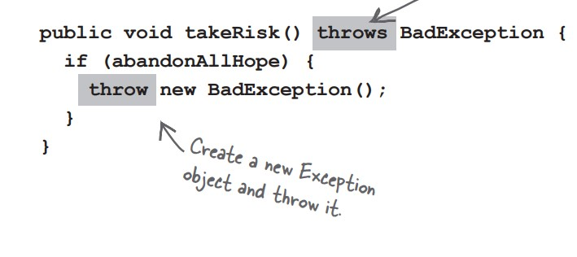

# java-journey

A code journal documenting my Java programming journey through practical examples and projects.

## Table of Contents

- [Music Machine](#music-machine)
- [Exception handling](#exception-handling)
  - [When things might go wrongs](#when-things-might-go-wrongs)
  - [Exception are object](#exception-are-object)
  - [Checked and unchecked exceptions](#checked-and-unchecked-exceptions)
  - [Bullet Points](#bullet-points)
  - [Flow control in try catch block](#flow-control-in-try-catch-block)
  - [Polymorphic exceptions](#polymorphic-exceptions)
  - [Order of multiple catch blocks](#order-of-multiple-catch-blocks)
  - [When you don’t want to handle an exception](#when-you-dont-want-to-handle-an-exception)
- [Music Machine : Fixing the sequencer code](#music-machine-fixing-the-sequencer-code)

## Music Machine

_JavaSound_ is a collection of classes and interfaces added to Java way back in version 1.3.JavaSound is split into two parts: MIDI and Sampled.MIDI stands for Musical Instrument Digital Interface. it does include the instructions that a MIDI-reading instrument can play back.

## Exception handling

First we need a Sequencer

The sequencer is the object that takes all the MIDI data and sends it to the right instruments.

```
import javax.sound.midi.MidiSystem;
import javax.sound.midi.Sequencer;

public class MusicTest1 {

    public void play() {
        try {
            Sequencer sequencer = MidiSystem.getSequencer();
            System.out.println("Successefully got a sequencer");
        }
    }

    public static void main(String[] args) {

        MusicTest1 mt = new MusicTest1();
        mt.play();
    }
}
```

compile error:


**What happens when a method you want to call (probably in a class you didn’t write) is risky?**

1- Let’s say you want to call a method in a class that you didn’t write.


2- That method does something risky, something that might not work at runtime.


3- You need to know that the method you’re calling is risky.


4- You then write code that can handle the failure if it does happen. You need to be prepared, just in case.


### When things might go wrongs

**Methods in Java use exceptions to tell the calling code,“Something Bad Happened. I failed.”**
Java’s exception-handling mechanism is a clean, well-lighted way to handle “exceptional situations” that pop up at runtime; it lets you put all your error-handling code in one easy-toread place. It’s based on the method you’re calling telling you it’s risky

So, how does a method tell you it might throw an exception? You find a throws clause in the
risky method’s declaration.

The getSequencer() method takes a risk. It can fail at runtime. So it must “declare” the risk you take when you call it.

 Method declaration")

1- The API docs tell you that getSequencer() can throw an exception: MidiUnavailableException. A method has to declare the exceptions it might throw

2- This part tells you WHEN you might get that exception—in this case, because of resource restrictions (which could mean the sequencer is already being used).

_Risky methods that could fail at runtime declare the exceptions that might happen using “throws SomeKindOfException” on their method declaration._

**The compiler needs to know that YOU know you’re calling a risky method**
If you wrap the risky code in something called a try/catch, the compiler will relax. A try/catch block tells the compiler that you know an exceptional thing could happen in the method you’re calling, and that you’re prepared to handle it. That compiler doesn’t care how you handle it; it cares only that you say you’re taking care of it.

```
import javax.sound.midi.MidiSystem;
import javax.sound.midi.MidiUnavailableException;
import javax.sound.midi.Sequencer;

public class MusicTest2 {

    public void play() {
        try {
            Sequencer sequencer = MidiSystem.getSequencer();
            System.out.println("Successefully got a sequencer");
        } catch (MidiUnavailableException e) {
            System.out.println("Bummer");
        }
    }

    public static void main(String[] args) {

        MusicTest2 mt = new MusicTest2();
        mt.play();
    }
}
```

Put the risky thing in a “try” block. It's the “risky" getSequencer method that might throw an exception.

Make a “catch” block for what to do if the exceptional situation happens—in other words, a MidiUnavailableException is thrown by the call to getSequencer().

### Exception are object

_An exception is an object... of type Exception_


Because an Exception is an object, what you catch is an object. In the following code, the catch argument is declared as type Exception, and the parameter reference variable is ex.


**If it’s your code that catches the exception, then whose code throws it?**

You’ll spend much more of your Java coding time handling exceptions than you’ll spend creating and throwing them yourself. For now, just know that when your code calls a risky method—a method that declares an exception—it’s the risky method that throws the exception
back to you, the caller.


When somebody writes code that could throw an exception, they must declare the exception

1- Risky, exception-throwing code: This method MUST tell the world (by declaring) that it throws a BadException.



2- Your code that calls the risky method: If you can’t recover from the exception, at LEAST get a stack trace using the printStackTrace() method that all exceptions inherit.


One method will _catch_ what another method _throws_. An exception is always thrown back to the caller. The method that throws has to _declare_ that it might throw the exception.

### Checked and unchecked exceptions

The compiler checks for everything except RuntimeExceptions.The compiler guarantees:

- If you throw an exception in your code, you must declare it using the throws keyword in your method declaration.

- If you call a method that throws an exception (in other words, a method that declares it throws an exception), you must acknowledge that you’re aware of the exception possibility.
  One way to satisfy the compiler is to wrap the call in a try/catch.


Exceptions that are NOT subclasses of RuntimeException are checked for by the compiler. They’re called “checked exceptions.”

RuntimeExceptions are NOT checked by the compiler. They’re known as (big surprise here) “unchecked exceptions.” You can throw, catch, and declare RuntimeExceptions, but you don’t have to, and the compiler won’t check.

### Bullet Points

- A method can throw an exception when something fails at runtime.
- An exception is always an object of type Exception. (This, as you remember from the polymorphism chapters (7 and 8), means the object is from a class that has Exception somewhere up its inheritance tree.)
- The compiler does NOT pay attention to exceptions that are of type RuntimeException. A RuntimeException does not have to be declared or wrapped in a try/catch (although you’re free to do either or both of those things).
- All Exceptions the compiler cares about are called “checked exceptions,” which really means compiler-checked exceptions. Only RuntimeExceptions are excluded from compiler checking. All other exceptions must be acknowledged in your code.
- A method throws an exception with the keyword throw, followed by a new exception object:
  throw new NoCaffeineException();
- Methods that might throw a checked exception _must_ announce it with a _throws SomeException_ declaration.
- If your code calls a checked-exception-throwing method, it must reassure the compiler that precautions have been taken.
- If you’re prepared to handle the exception, wrap the call in a try/catch,and put your exception handling/recovery code in the catch block.
- If you’re not prepared to handle the exception, you can still make the compiler happy by officially “ducking” the exception. We’ll talk about ducking a little later in this chapter.

### Flow control in try catch block

When you call a risky method, one of two things can happen. The risky method either succeeds, and the try block completes, or the risky method throws an exception back to your calling method.

If the try **succeeds** :


If the try **fails** :


_Finally_: for the things you want to do no matter what.

**_A finally block is where you put code that must run regardless of an exception._**

```
try {
  turnOvenOn();
  x.bake();
} catch (BakingException e) {
  e.printStackTrace();
} finally {
  turnOvenOff();
}
```

Did we mention that a method can throw more than one exception?

A method can throw multiple exceptions if it darn well needs to. But a method’s declaration must declare all the checked exceptions it can throw (although if two or more exceptions have a common superclass, the method can declare just the superclass).

The compiler will make sure that you’ve handled all the checked exceptions thrown by the method you’re calling. Stack the catch blocks under the try, one after the other. Sometimes the order in which you stack the catch blocks matters,


### Polymorphic exceptions

Exceptions are objects, remember. There’s nothing all that special about one, except that it is a thing that can be thrown. So like all good objects, Exceptions can be referred to polymorphically.


1- You can DECLARE exceptions using a superclass of the exceptions you throw.


2- You can CATCH exceptions using a superclass of the exception thrown.


_Just because you CAN catch everything with one big super polymorphic catch, doesn’t always mean you SHOULD._

```
try {
 laundry.doLaundry();
} catch(Exception ex) {
 // recovery code...
}
```

Write a different catch block for each exception that you need to handle uniquely.

```
try {
 laundry.doLaundry();
} catch (TeeShirtException tex) {
 // recovery from TeeShirtException
} catch (LingerieException lex) {
 // recovery from LingerieException
} catch (ClothingException cex) {
 // recovery from all others
}
```

### Order of multiple catch blocks

- Multiple catch blocks must be ordered from smallest to biggest
- You can’t put bigger baskets above smaller baskets

### When you don’t want to handle an exception

If you don’t want to handle an exception, you can **duck** it by **declaring** it.

```
public void foo() throws ReallyBadException {
 // call risky method without a try/catch
 laundry.doLaundry();
}
```

You don’t have a try/catch for the risky method you call, YOU are now the “risky method” Because now, whoever calls YOU has to deal with the exception

Ducking (by declaring) only delays the inevitable,


**Handle or Declare. It’s the law.**

- Handle :


- Declare (Duck it) :


## Music Machine : Fixing the sequencer code

To DO
