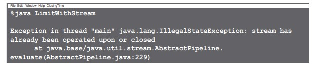
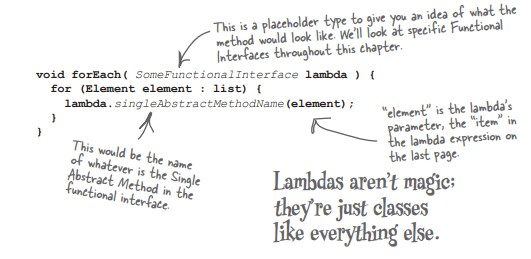
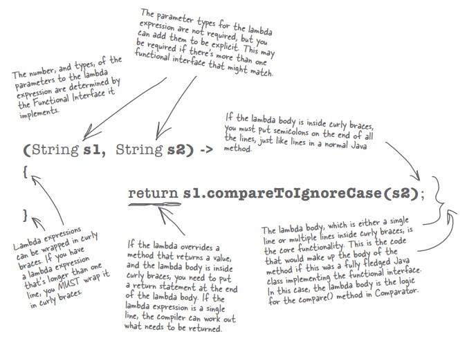

# java-journey

A code journal documenting my Java programming journey through practical examples and projects.

## Table of Contents

- [Using IS-A and HAS-A](#using-is-a-and-has-a)
- [Serialization](#serialization)

## La Programmation fonctionnelle

la programmation _fonctionnelle_ est un paragadime de programmation. dans un programme fonctionnel, tous les éléments peuvent etre compris comme _des fonctions_ et le code peut etre exécuté par des _appels successifs_ de fonctions.

Javapermet d'approcher la programmation fonctionnelle grace aux **interfaces fonctionnelles** et aux **expressions lambda**.

Les principales caracteristiques de la programmation fonctionnelle :

- Les fonctions pures : ce sont des fonctions qui ne dépendent que de leurs propres paramètres.

- L’immutabilité :

- L’écriture lazy :

- La séparation et le traitement des données :

- Les fonctions anonymes :

- La composition :

## Interfaces fonctionnelles

To DO

## Les expressions Lambda

To DO

## Introducing the Streams API

The Streams API is a set of operations wa can perform on a collection.bellow some examples:

- Filter : only allows elements that match the given criteria to remain in the Stream.
- Skip : This is the number of elements at the start of the Stream that will not be processed.
- limit : Sets the maximum number of elemnts that can be output from this Stream.
- distinct : Use this to make sure duplicates are removed.
- sorted : States the result of the Stream should be ordered in some way.
- map : Changes the current element in the stream into something else.
- dropWhile : While a given criteria is true, will not process elemnts.
- takeWhile : Will only process elemnts while the given criteria is true.

```
    List<String> strings = List.of("I", "am", "a", "list", "of", "strings");
    Stream<String> stream = strings.stream();
    Stream<String> limit = stream.limit(4);
    System.out.println(limit);
```

the result :

```
java.util.stream.SliceOps$1@7adf9f5f
```

Like everything in java, the stream variables in the example are Objects. But a stream does not contain the elemnts in the collection.It's more like the set of instructions for the operations to perform on Collection data.

Stream methods that return another Stream are called **Intermediate Operations**. These are instructions of things to do, but the don't actually perform the operation on their own.

You need to call one of the Stream's _do it_ methods in orther to get the result you want. called **Terminal Operations**.and these are the methods that will actually return something to you.

```
    List<String> strings = List.of("I", "am", "a", "list", "of", "strings");
    Stream<String> stream = strings.stream();
    Stream<String> limit = stream.limit(4);
    long result = limit.count();
    System.out.println("result = "+result);
```

one of the most common things to do with Streams is put the results into another type of colection.

```
    List<String> result = limit.collect(Collectors.toList());
```

### Stream operations are building blocks

you can create a **stream pipeline** from three different types of building blocks.

- Get the stream from a _source_ collection.
- call zero or more _intermediate operations_ on the Stream.
- Output the result with a _terminal operation_.

You need at least the _first_ and _last_ step tu use Streams API. the operations are designed to be **chained**, so you can call one stage straight after the previous one.

```
    List<String> result = strings.stream()
                                 .skip(2)
                                 .limit(4)
                                 .collect(Collectors.toList());
```

The source, the intermediate operation(s), and terminal opertaion all combine to form a **Stream Pipeline**. this pipeline represents a query on the original collection.

#### Collecting to a List

- collect : First of all perfome all intermediate operations, in this case skip;limit. AND colllect the results according to the instructions passed into it. AND returns those results.
- Collectors : is a class that has static static methods that provide different implementations of Collector.
- Collectors.toList() : The collect method takes a Collector, the recipe for how to put together the results. In this case, it's using a helpful predefined Collector that puts the results into a list.

## Guidelines for working with Streams

1. You need at least the first and the last pieces to create a stream pipeline.
   _stream()_ and _terminal operation_ is necessary.
2. You can't reuse Streams.
   once a terminal operation has been called on a stream, you can't reuse any parts of that stream;you have to create a new one.

```
Stream<String> limit = strings.stream()
                               .limit(4);
List<String> result = limit.collect(Collectors.toList());
List<String> result2 = limit.collect(Collectors.toList());
```



3. You can't change the underlying collection while the stream is operating.

it's possible to write programms that run different bits of code at the same time (Concurrency). To be safe, it's usually best (not just for Streams, but general) to create a collections that can be changed if you know they don't need to be changed.

## Hello Lambda

### Abstract Method

An abstract method is a method declared without an implementation (i.e., no body) inside an abstract class or interface.

🔹 Syntax:

```
public abstract class Animal {
    abstract void makeSound(); // Abstract method - no body
}
```

Any class that extends Animal must override this method and provide a concrete implementation:

```
public class Dog extends Animal {
    @Override
    void makeSound() {
        System.out.println("Woof!");
    }
}
```

✅ Why Are Abstract Methods Useful?

- They enforce contracts: subclasses must implement required behavior.

- Enable polymorphism: you can use abstract types while calling subclass implementations.

- They are essential for Functional Interfaces, where one abstract method represents the behavior.

### Functional Interface

🔹 What is a Functional Interface?
A functional interface in Java is an interface that contains exactly one abstract method. It can have multiple default or static methods, but only one method without an implementation.

Functional Interface is additionally recognized as Single Abstract Method Interfaces. In short, they are also known as SAM interfaces.

Java 8 introduced this concept to enable functional programming using lambdas and method references.

```
@FunctionalInterface
public interface MyFunction {
    void apply(); // Only one abstract method
}
```

🔹 Why Functional Interfaces are Useful
They are powerful because they allow us to pass behavior (functions) as parameters, enabling a cleaner, more flexible coding style—especially in APIs like Streams.

🔹 Common Utility Use Cases

- Cleaner Code with Lambdas:

```
Runnable r = () -> System.out.println("Running");
```

- Cleaner Code with Lambdas:

```
List<String> names = List.of("Anna", "Bob", "Sam");
names.stream()
     .filter(name -> name.length() == 3)      // Predicate<String>
     .map(String::toUpperCase)                // Function<String, String>
     .forEach(System.out::println);           // Consumer<String>
```

- Cleaner Code with Lambdas:

```
@FunctionalInterface
interface Converter<T, R> {
    R convert(T input);
}
```

### Lambda Expression



### Anatomy of a lambda expression



### Interfaces : Static and Default methods

#### Static Methods

Since Java 8, you can add static methods inside an interface.

A static method belongs to the interface itself, not to the classes that implement it.

- Why is it useful?
  To provide utility/helper methods related to the interface.

- Example:

```
interface Calculator {
    static int add(int a, int b) {
        return a + b;
    }
}
```

- Usage:

```
int result = Calculator.add(5, 3);  // No need to implement Calculator
System.out.println(result);         // Output: 8
```

#### Default Methods

Also introduced in Java 8.

A default method has a default implementation.

Classes can override it if they want to.

- Why is it useful?
  It allows adding new methods to interfaces without breaking existing code that already implements those interfaces.

- Example:

```
interface Vehicle {
    default void start() {
        System.out.println("Vehicle is starting...");
    }
}
```

Class implementing the interface without needing to override start():

```
class Car implements Vehicle {
    // No need to override start() unless I want a custom behavior
}
```

- Usage:

```
Car car = new Car();
car.start();  // Output: Vehicle is starting...
```
