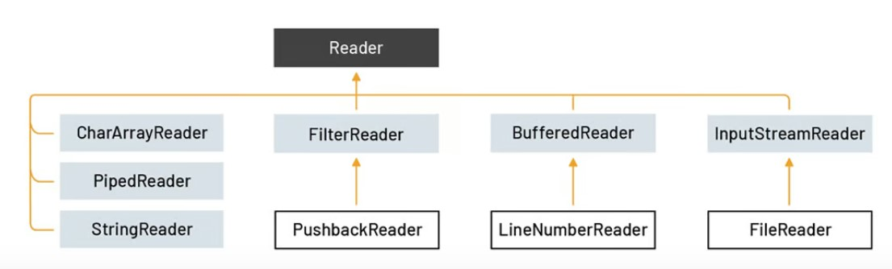

# java-journey

A code journal documenting my Java programming journey through practical examples and projects.

## Table of Contents

- [The stack and the heap](#the-stack-and-the-heap)
  - [The stack and the heap : Where things live](#the-stack-and-the-heap-Where-things-live)
  - [Methods are stacked](#methods-are-stacked)
  - [Object references on the stack](#object-references-on-the-stack)
- [Object creation](#object-creation)
  - [Initializing object state](#initializing-object-state)
  - [Overloaded and default constructors](#overloaded-and-default-constructors)
  - [Superclass constructor](#superclass-constructor)
  - [Object construction](#object-construction)
  - [Object lifecycle](#object-lifecycle)
  - [Calling overloaded constructors](#calling-overloaded-constructors)
  - [Object lifespan](#object-lifespan)
- [The garbage collector](#the-garbage-collector)

## The stack and the heap

To DO

### The stack and the heap : Where things live

To DO

### Methods are stacked

To DO

### Object references on the stack

TO DO

## Object creation

To Do

### Initializing object state

To Do

### Overloaded and default constructors

To Do

### Superclass constructor

To Do

### Object construction

To Do

### Object lifecycle

To Do

### Calling overloaded constructors

To Do

### Object lifespan

To Do

## The garbage collector

To Do

