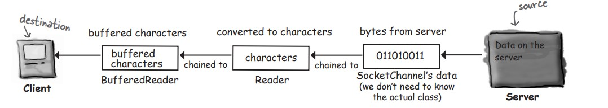
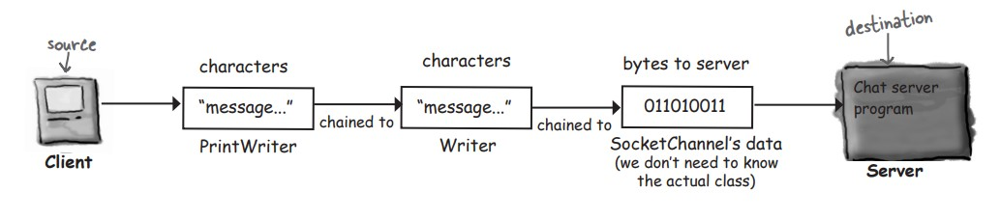

# java-journey

A code journal documenting my Java programming journey through practical examples and projects.

## Table of Contents

- [Chat program overview](#chat-program-overview)

## Chat program overview

Each client has to know about server. and the server has to know about all the clients.


### Connecting, sending, and receiving

The three things we have to learn to get the client working are:

- How to establish the initial _connection_ between the client and server.
- How to _receive_ message from the server.
- How to _send_ message to ther server.

1. Connect

To talk to an other machine we need an object that represents a network connection between two machines. we ca open a java.nio.channels. SocketChannel to give us this connection object.
Most important that things two machine know how to communicate with each others.in other word, how to send bits to each others.
to make a connection you need to know two thins about the server: where it is and witch port it's running on.in other words : IP adress and TCP port number.

```
    InetSocketAddress serverAdress = new InetSocketAddress("196.164.1.103", 5000);
    SocketChannel socketChannel = SocketChannel.open(serverAdress);
```

InetSocketAddress: Represents the full adress of the machine we want to connect to.
SocketChannel: We can use a SocketChannel to talk to another machine.

open(serverAdress): You don't use a constructor to create a new SocketChannel, you call the static open() method. this will create a new SocketChannel and connect it to the adress you give it.

_A coonection means the two machines have information about each other, including network(IP Adress) and TCP Port._

2. Receive

You can use BufferedReader just like you did when you were reading from a file. the difference is that the underlying connection stream is connected to a _Channel_ rather than a _File_!

- Make connection to the server

```
    InetSocketAddress serverAdress = new InetSocketAddress("127.0.0.1", 5000);
    SocketChannel socketChannel = SocketChannel.open(serverAdress);
```

- Create or get a Reader from the connection

```
    Reader reader = Channels.newReader(socketChannel, StandardCharsets.UTF_8);
```

- Make a BufferedReader and read!

```
    BufferedReader bufferedReader = new BufferedReader(reader);
    String message = bufferedReader.readLine();
```



3. Send

to write a character data , we have a choice here. **BufferedWriter** but when you 're writing one String at time , **PrintWriter** is a standard choice. two methods in PrintWriter : print() and println().

- Make a connection to ther server

```
    InetSocketAddress serverAdressRecieve = new InetSocketAddress("127.0.0.1", 5000);
    SocketChannel socketChannelRecieve = SocketChannel.open(serverAdressRecieve);
```

- Create or get a Writer from the connection

```
    Writer writer = Channels.newWriter(socketChannelRecieve, StandardCharsets.UTF_8);
```

Writer acts as a bridge between characters data and the bytes data to be written to the Channel.

The channels class contains utility methods to create a Writer.

You need to say witch Charset to use to write Strings. You should use the same one for reading as for writing!

- Make a printWriter and write (print) something

```
    PrintWriter printWriter = new PrintWriter(writer);
    printWriter.println("message to send");
    printWriter.print("another message");
```

By chaining a PrintWriter to the Channels's Writer, we can write Strings to the Channels, witch will be sent over the connection.

println() : add new line at the end of what we sends.

print() : doesn't add the new line.



### There's more than one way to make a connection

there is a number of different ways to make a connection. Witch approach you use depends on a number of things :

- how many clients connect at once.
- the size of the message sent.
- frequency or message.

one the simplest approaches is to use a **java.net.Socket** instead of a Channel.

**Using a Socket**

you can get un inputStream or OutputStream from a Socket, and read and write from it in a very similar way to what we have already seen.

```
    Socket chatSocket = new Socket("127.0.0.1", 5000);

    InputStreamReader in = new InputStreamReader(chatSocket.getInputStream());

    BufferedReader reader = new BufferedReader(in);
    String message = reader.readLine();

    PrintWriter writer = new PrintWriter(chatSocket.getOutputStream());
    writer.println("message to send");
    writer.println("another message");
```

Instead of using a InetSocketAdress and opening a SocketChannel, you can create a Socket with the host and port number.

To read from the socket, we need to get an InputStream from the Socket.

To write to the socket, we need to get an OutputStream from the socket witch we ca chain to the PrintWriter.

_Relax_ : Channels can support nonblocking I/O, reading and writing via ByteBuffers, and asynchronous I/O.
