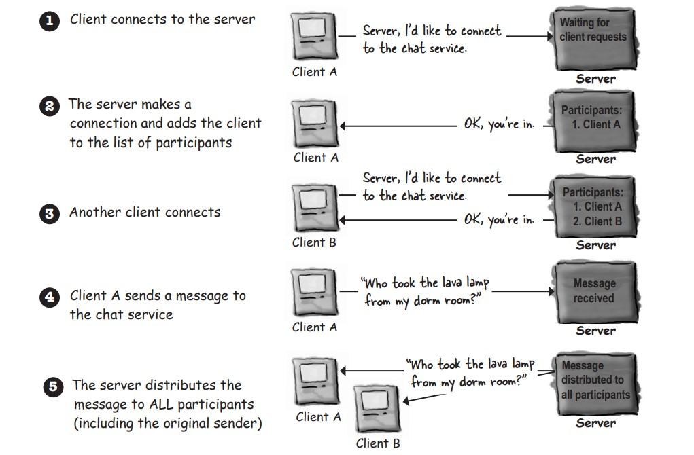

# java-journey

A code journal documenting my Java programming journey through practical examples and projects.

## Table of Contents

- [Chat program overview](#chat-program-overview)

## Chat program overview

Each client has to know about servre. and the server has to know about all the clients.

### Connecting, sending, and receiving

The three thingswe have to learn to get the client working are:

- How to establish the initial connection between the client and server.
- How to receive message from the server.
- How to send message to ther server.

1. Connect

to make a cooenction you need to know two thins about the server: where it is and witch port it's running on.in other words : IP adress and TCP port number.

2. Receive

3. Send
