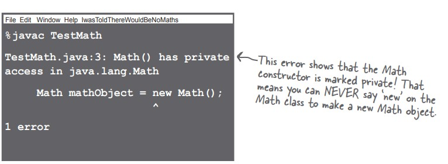
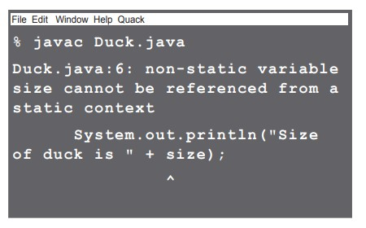

# java-journey

A code journal documenting my Java programming journey through practical examples and projects.

# Table of Contents

- [MATH methods](#math-method)
  - [Static methods](#static-methods)
    - [The difference between regular and static methods](#the-difference-between-regular-and-static-methods)
    - [What it means to have a class with static methods](#what-it-means-to-have-a-class-with-static-methods)
    - [Static methods can't use non-static (instance) variables](#static-methods-can-t-use-non-static-instance-variables)
    - [Static methods can't use non-static methods](#static-methods-can-t-use-non-static-methods)
  - [Static variable](#static-variable)
    - [Value is the same for ALL instances of the class](#value-is-the-same-for-all-instances-of-the-class)
    - [Initializing a static variable](#initializing-a-static-variable)
    - [Static final variables are constants](#static-final-variables-are-constants)
  - [Math methods](#math-methods)
- [Wrapper classes](#wrapper-classes)
  - [Wrapping a primitive](#wrapping-a-primitive)
  - [Wrappers have static utility methods too](#wrappers-have-static-utility-methods-too)
  - [Turning a primitive number into String](#turning-a-primitive-number-into-string)
- [Number formatting](#number-formatting)
  - [Formatting deconstructed](#formatting-deconstructed)
  - [The format specifier](#the-format-specifier)
- [Static vs Instance Variable](#static-vs-instance-variable)
- [Apendix](#appendix)
  - [Using Java Reflection](#using-java-reflection)

# MATH methods

## Static methods

Methods in the class don't use any instance variable values. and because the methods are **static**, oyu dont' need to have an **instance** of Math. All you need is the Math _class_.

```
long x = Math.round(42.2);
int y = Math.min(56, 12);
int z = Math.abs(-343);
```

abs,round,min,max... : these methods never use instance variables, so their behavior doesn't need to know about a specific object.

If you try to make an instance of class Math :

```
Math mathObject = new Math();
```

You well get this error:



### The difference between regular and static methods

The keyword **static** lets a method run **without any instance of the class**. A static method means _behavior not dependent on an instance variable,so no instance/object is required. just the class._

```
public lass Song {
  String title;
  public Song(String title){
    title = t;
  }
  public void play(){
    SoundPlayer player = new SoundPlayer();
    player.playSound(title);
  }
}
```

if we create two object of Song :

```
Song s1 = new Song("Inass Inass");
Song s2 = new Song("lemhayen");
```

execute play() in s1 will play "Inass inass mayrigh" and in s2 ""alm7ayen alf9ayess".

play() result depend on the instance of the class Song. but in static method the behavior of the method depend on method parameters :

```
Math.min(42,36);
```

Use the class name, rather than a reference variable name. NO OBJECTS!! Absolutely no objects.

| Non-Static Methods             | Static Methods               |
| ------------------------------ | ---------------------------- |
| Call a non-static method using | Call a static method using a |
| a **reference variable** name  | **Class name**.              |
| ```                            | ```                          |
| Song t2 = new Song()           | Math.min(88,86);             |
| t2.play()                      | ```                          |
| ```                            |                              |

### What it means to have a class with static methods

- Abstract classes : class where it impossible for anyone to say _new_ on that class type.In other words, **it's impossible to instantiate an abstract class.**
- But we can restrict other code from instantiating a non-abstract class by making the **constructor private**.
- You re free to combine static and non-static methods in the same class.(for more information, check appendix)

### Static methods can't use non-static (instance) variables

If you try to use an instance variable from inside a static method.the compiler thinks,"i don't know witch object's instance variable you re talking about!". If you have ten Duck objects on the heap, a static method doesn't know about any of them.

If you try to compile this code:

```
public class Duck {
    private int size;

    public static void main(String[] args) {
        System.out.println("Size of the duck is " + size);
    }

    public void setSize(int size) {
        this.size = size;
    }

    public int getSize() {
        return size;
    }
}
```

You will get this error :



### Static methods can't use non-static methods

They usually use instance variable state to affect the behavior of the method.
If you try to compile this code:

```
public class Duck {
    private int size;

    public static void main(String[] args) {
        System.out.println("Size of the duck is " + size);
    }

    public void setSize(int size) {
        this.size = size;
    }

    public int getSize() {
        return size;
    }
}
```

you will get the same error. because calling getSize() just **postpones** the inevitable - getSize() uses the size instance variable.

But what if the getSize() doesn't use any instance variable. will the compiler allow that ?

No !! what happens if in the futur you want to change the implrmentation so that one day it does use an instance variable ? OR a subclass ovverides the method and uses an instance variable in the overriding version ?

**STATIC CAN'T SEE INSTANCE VARIABLE STATE**

## Static variable

### Value is the same for ALL instances of the class

Imagine you wanted to count how many Duck instances are being created while your program is running ? Maybe an instance variable that you increment in the constroctur:

```
class Duck {
  int duckCount = 0;
  public Duck(){
    duckCount++;
  }
}
```

No, that wouldn't work because duckCount is an instance variable and start at 0 for each Duck.
Thats's what static variable gives you : a value shared by all instances of a class. In other words, one value per _class- instead of one value per \_instance_.

```
class Duck {
  static int duckCount = 0;
  public Duck(){
    duckCount++;
  }
}
```

the static duckCount variable is **Initialized only when the class is first loaded**, not each time a new instance is made.

Static variables are shared. All instances of the same class share a single copy of the static variables.

- Instance variable : 1 per **instance**
- Static variables : 1 per **class**

### Initializing a static variable

There are two guarantees about static initialization:

- Static variables in a class are initialized before any _objetc_ of that class can be created.
- Static variables in a class are initialized before any _static method_ of the class runs.

### Static final variables are constants

A variable marked **final** means that --once initialized--it can never change.In other words, the value of the static final variable will stay the same as long as the class is loaded.

```
public static final double PI = 3.141592653589793
```

1- The variable is marked **public** so that any code can access it.
2- The variable is marked **static** so you don't need an instance of class Math.
3- The variable is marked **final** because PI doesn't change.

A static Initializer is a block of code that runs when a class is loaded, before any other code can use the class, so it's a great place to initialize a static final variable.

Initialize a final static variable :

- AT the time you declare it:

```
public class ConstantInit {
  public static final int X_VAL = 25;
}
```

- In a static initializer:

```
class ConstantInit {
  final static int X_VAL;
  static {
    X_VAL = 42;
  }
}
```

if you don't give a value to a final variable in one of those two places, the compiler will catch it.

final isn't just for static variables, we can use the keyword **final** to modify non-static variables too.

- A final **variable** means you can't **change** its value.
- A final **method** means you can't **override** the method.
- A final **class** means you can't **extend** the class (i.e., you can't make a subclass)

## Math methods

Math.abs(), Math.random(), Math.round(), Math.min(), Math.max(), Math.sqrt() ...

# Wrapper classes

## Wrapping a primitive

Sometimes you want to treat a primitive like an object, collection like ArrayList only work with objects:
ArrayList<???> list;

There's a wrapper class for every primitive type, in java.lang package.

Boolean, Character, Bytes, Short, Integer, Long, Fload, Double.

Wrapping a value:

```
int i = 288;
Integer iWrap = new Integer(i);
```

Unwrapping a value:

```
int unwrpped = iWrap.intValue();
```

Notice:
I can't make an arrayList of ints ? ArrayList<int> list; ? no we should use wrapping primitive, but java do all this for us automatically . **Autaubox**, wrapping and unwrapping primitives automatically.

Autoboxing works almost everywhere :

- Methods argumets
- Return values
- Boolean expressions
- Operations on numbers
- Assignments

## Wrappers have static utility methods too

the wrappers have a bunch of really useful static methods. for example _parse_ methods.

```
Integer.parseInt("3");
Integer.parseDouble("420.24");
Integer.parseBoolean("True");
```

## Turning a primitive number into String

and now in reverse... turning a primitive number into a String.

```
double d = 42.5;

//Using "+" operator
String doubleString1 = "" + d;

//Using toString() method
String doubleString2 = Double.toString(d);

//Using valueOf() method
String doubleString3 = String.valueOf(d);
```

# Number formatting

To Do

## Formatting deconstructed

To Do

## The format specifier

To Do

# Static vs Instance Variable

| Static variables | Instance variables |
| ---------------- | ------------------ |
| Static to do     | Instance to do     |

# Appendix:

## Why not declare an ArrayList<int> if you want to hold ints ?

The rule for generic types is that you can specify only class or interface types, not primitives.

## Using Java Reflection


