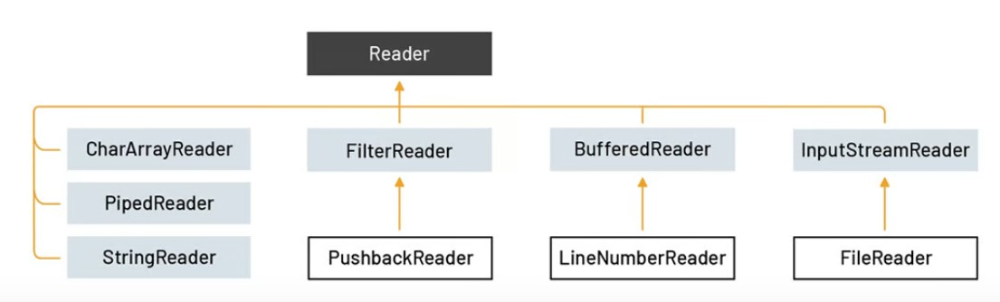
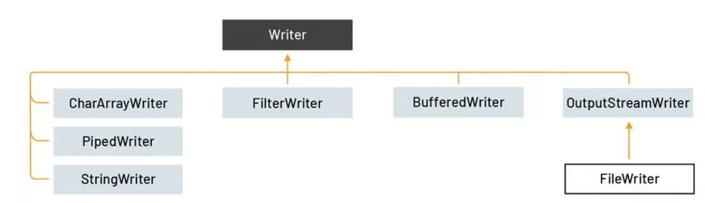

# java-journey

A code journal documenting my Java programming journey through practical examples and projects.

## Table of Contents

- [Saving Objects (and Text)](#saving-objects-and-ext)
- [Serialization](#serialization)
- [Deserialization](#deserialization)
- [The java.io.File Class](#the-javaiofile-class)
  - [FileReader and FileWriter](#FileReader-and-FileWriter)
  - [The beauty of buffers](#the-beauty-of-buffers)
- [NIO.2 and The java.nio.File Class](#nio2-and-the-javaniofile-class)

## Saving Objects (and Text)

To DO

## Serialization

To DO

## Deserialization

To DO

## The java.io.File Class

The `java.io.File` is an older class in the Java API that has been largely replaced by classes in the `java.nio.file` package in newer Java versions.

Basic usage:

```java
import java.io.File;

File file = new File(fileName);
```

the file Object represents the name and the path of a file or directory on disk. But it doesn't represent , or give you access to, the data in the file!

Important concept: An address is NOT the same as the actual house! A File object is like a street address... it represents the name and location of a particular file, but it isn't the file itself.

For more code details and examples, check the implementation in FileClass.java.

### FileReader and FileWriter

The FileReader class is used to read character-by-character.



FileWriter is used to write character-by-character.



### The beauty of buffers

Give you a temporary holding place to group things until the the holder( like a shoping cart) is full. You get to make far fewer trips when you use a buffer.

```
        String fluxCaracterefileName = "flux_caractere_file.txt";

        // File Reader
        try (BufferedReader bufferedReader = new BufferedReader(new FileReader(fluxCaracterefileName))) {

            bufferedReader.lines()
                    .forEach(System.out::println);
        } catch (FileNotFoundException e) {
            System.out.println("the file " + fluxCaracterefileName + " doesn't exist !");
        } catch (IOException e) {
            e.printStackTrace();// print the details of
        }

        // File Writter

        try (BufferedWriter bufferedWriter = new BufferedWriter(new FileWriter(fluxCaracterefileName, true))) {

            bufferedWriter.write("line 1");
            bufferedWriter.newLine();
            bufferedWriter.write("line 2");
        } catch (IOException e) {
            e.printStackTrace();
        }
```

## NIO.2 and The java.nio.File Class

java NIO.2 is usually taken to mean two packag in java 7 :

- java.nio.file: lets you manipulate the metadata associated with a computer's files and directories.like permissions settings.
- java.nio.file.attribute : do common test file reading and writing, and it also provides you with the ability to manipulate a computer's directories and directory structure.

we can distingue three types in java.nio.file:

- The Path interface : You will always need a path object to locate the directories or files you want to work with.
- The Paths class: You will use the Paths.get() methode to make the path object you will need when you use methodsin the Files class.
- The Files class: This is the class whose (static) methods do what you will want to do: making new Readers and Writers , and creatig modifying, and searshing through directories and files on file system.

creating a BufferedWriter with NIO.2

import Path, Paths, and Files:

```
import java.nio.file
```

Make a Path object using the Paths:

```
Path myPath = Paths.get("/myApp/path/to/files/myFile.txt");
```

Make a new BufferedWriter using a Path and the Files class:

```
BufferedWriter bf = Files.newBufferedWriter(myPath);
```

For more details check APINIO2.java File.
