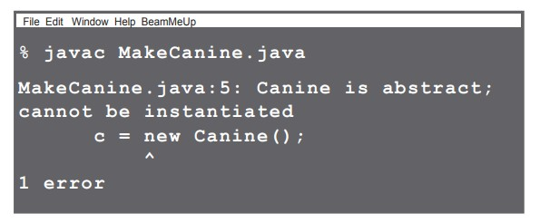
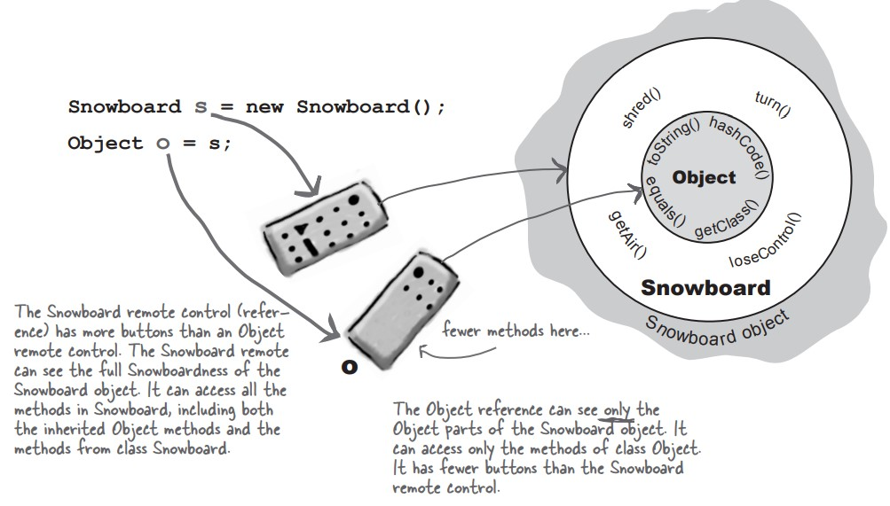

# java-journey

A code journal documenting my Java programming journey through practical examples and projects.

# Table of Contents

- [Abstract and concrete classes](#abstract-and-concrete-classes)
  - [Abstract Class](#abstract-class)
  - [Abstract methods](#abstract-methods)
- [Polymorphism in action](#polymorphism-in-action)
  - [Super-megaclass Object](#super-megaclass-Object)
  - [Objects don't bark](#objects-don-t-bark)
  - [Inner object](#inner-object)
  - [Casting an object](#casting-an-object)
- [Interfaces](#interfaces)
  - [Interfaces and polymorphism](#interfaces-and-polymorphism)
  - [Using Super](#using-super)
- [Apendix](#appendix)
  - [Using Java Reflection](#using-java-reflection)

# Abstract and concrete classes


let's use this class diagram to study polymorphism:

we know we can say : Wolf aWolf = new Wolf();

And we know we can say : Animal aHippo = new Hippo();

But here's where it gets weird: Animal anim = new Animal();

waht the heck does an Animal object look like ? What does an animal object look like ? What are the instance variable values ?

**Some classes just should not be instantited**

it make sense to make a Wolf object or a Hippo object, but what exactly is an animal object? what shape is it ? What color, size,number of legs ...

But how do we deal with this ? We need an Animal class for inheritance and polymorphism. But we want programmers to not instantiate it.

## Abstract Class

An abstract class means that nobody can ever make a new instance of that class.
Making a class abstract is easy :

```
abstract class Canine extends Animal {
  public void roam();
}
```

if you try this code :

```
public class MakeCAnine {
  public void go() {
    Canine c = new Canine();
    c.roam();
  }
}
```

you will get error :



An **abstract class** has virtually no use, no value, no purpose in life, unless it is **extended**.With an abstract class, it's the **the instance of a subsclass** of your abstract class that's doing the work at runtime.

A class that's not abstract is called a _concrete_ class.

## Abstract methods

Besides classes, you can mark _methods_ abstract, too.AN abstract class means the class must be **extended**; an abstract methods means the method must **overridden**.

An abstract method has no body.

you can make an abstract method :

```
public **abstract** void eat();
```

if you declare an abstract method, you MUST mark the class abstract as well. You can't hve an abstract method in a non-abstract class.

The first concrete class in the inheritance tree must implement all abstract methods.

When we say "you must impliment the abstract method" that's means you _must provide a body_; That means you must create a non abstract method in your class with the same signature (name and arguments) and a return type that compatible with the declared return type of the abstract method.

# Polymorphism in action

Let's say that we want write our own kind of list class, one that will hold dog objects :

```
public class MyDogList {
    private Dog[] dogs = new Dog[5];
    private int nextIndex = 0;

    public void add(Dog dog) {
        if (nextIndex < dogs.length) {
            dogs[nextIndex] = dog;
            System.out.println("Dog added at " + nextIndex);
            nextIndex++;
        }
    }
}
```

Uh-Oh we need to keep cats, too, wa have a few options here :

- make a separate class MyCatList, to hold Cat objects
- make a single class, DogAndCatList that keep **Two different arrays** as instance variables and has **two different add() methods**.
- Make a heterogeneous AnimalList class that takes \_any_kind of animal subclass.

```
public class MyAnimalList {
    private Animal[] animals = new Animal[5];
    private int nextIndex = 0;

    public void add(Animal animal) {
        if (nextIndex < animals.length) {
            animals[nextIndex] = animal;
            System.out.println("Dog added at " + nextIndex);
            nextIndex++;
        }
    }
}
```

## Super-megaclass Object

What about non-animals? Why not make a class generic enough to take anything ?

**Every class in java extends class object**, class object is the mother of all classes;it's the superclass of everythings. and evry class you write extends Object. and **Any class that doesn't explicitly extend another class, implicitly extends _Object_.**

Every class you write inherites all the methods of class object. The classes you've written inherited methofs you didn't even know you had.

- equals(Object o) : tell you if two objects are considered "equal"
- getClass() : Gives you back the class that object was instantiated from.
- hashCode() : Prints out a hashCode for the object (unique ID)
- toString() : Prints out a string message with the name of the class and some other number.


The object class serves two main purposes :

- to act as a polymorphic type for methods that need to work on any class.
- to provide real method code that all objects in java need at runtime.

Using polymorphic references of type object has a price ...

When you putan object into an ArrayList<Dog>, it goes in as a Dog and comes out as a Dog. but when you declare it as ArrayList<Object>, it goes in as a _specific Object_ (dog, fish, guitar...) and comes out as an Object.

Everything comes out of an arrayList<Object> as a reference of type Object,regardless of what the actual object is or what the refence type was when you added the object to the list.

```
ArrayList<Object> myObjectArrayList = new ArrayList<Object>();
Dog dog = new Dog();
Fish fish = new Fish();
Guitar guitar = new Guitar();
// goes in as an object : dog , fish guitar ...
myObjectArrayList.add(dog);
myObjectArrayList.add(fish);
myObjectArrayList.add(guitar);

//comes out as a generic Object
var object = myObjectArrayList.get(0);
```

Yhe compiler decides whether you can call a method besed on the reference type, not the actual object type.


## Inner object

An object contains everything it inherits from each of its superclasses. That means every object—regardless of its actual class type—is also an instance of class Object. That means any object in Java can be treated not just as a Dog, Button, or Snowboard, but also as an Object


Polymorphism means many forms, you can treat a Snowboard as a Snowboard or as an Object.



## Casting an object

casting an object reference back to its real type. it's really still a Dog, but if you want call Dog specific methods, you need a reference declared as type Dog.

- if you are sure the object is really a Dog, you can make a new Dog refence to it:

```
Object o = al.get(index);
Dog d = (Dog) o;
d.roam();
```

- if you're not sure it's a Dog, you can use the _instanceof_ operator check.

```
if(o instanceof Dog){
  Dog d = (Dog) o;
}
```

# Interfaces

## Interfaces and polymorphism

A java interface solves your multiple inheritance problem by giving you much of the polymorphic _benefits_ of multiple inheritance without the pain and suffering from the Deadly Diamond of Death (DDD).

A java interface is like a 100% pure abstract class. All methods in an interfaces are abstract, so any class that IS-A must implement(override) the methods.

Making and implementing the Pet interface:

```
public interface Pet {
  public abstract void beFriendly();
  public abstract void play();
}

public class Dog extends Animal implements Pet {
  public void bFriendly();
  public void play();

  public void roam();
  public void eat();
}
```

Java weighs in on family values:
Single Parents Only!! A Java class can have only one parent (superclass), and that parent
class defines who you are. But you can implement multiple interfaces, and those interfaces
define roles you can play.

▪ Make a class that doesn’t extend anything (other than Object) when your new class doesn’t pass the IS-A test for any other type.
▪ Make a subclass (in other words, extend a class) only when you need to make a more specific version of a class and need to override or add new behaviors.
▪ Use an abstract class when you want to define a template for a group of subclasses, and you have at least some implementation code that all subclasses could use. Make the class abstract when you want to guarantee that nobody can make objects of that type.
▪ Use an interface when you want to define a role that other classes can play, regardless of where those classes are in the inheritance tree.

## Using Super

```
abstract class Report {
    void runReport() {
        // set up report
    }

    void printReport() {
        // generic printing
    }
}

class BuzzwordsReport extends Report {
    void runReport() {
        super.runReport();
        buzzwordCompliance();
        printReport();
    }

    void buzzwordCompliance() {...}
}

```


# Appendix:

Q : Deadly Diamond of Death : multiple inheritance.


| Test | test |
| ---- | ---- |
| test | test |
